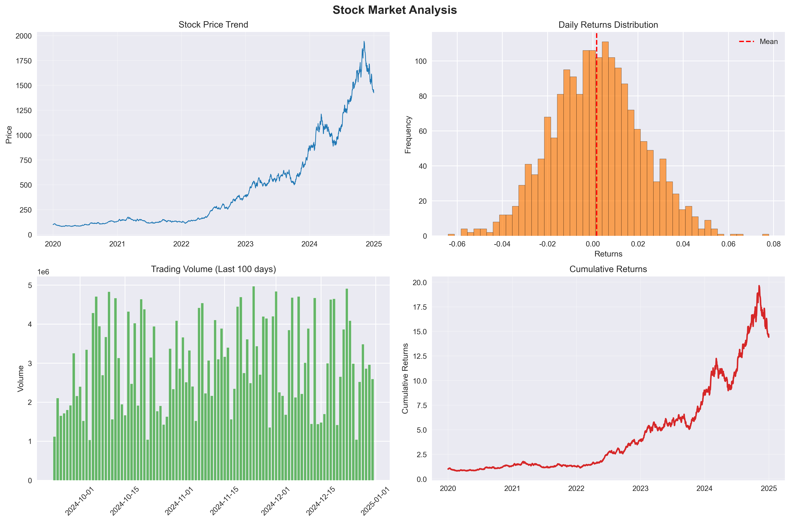
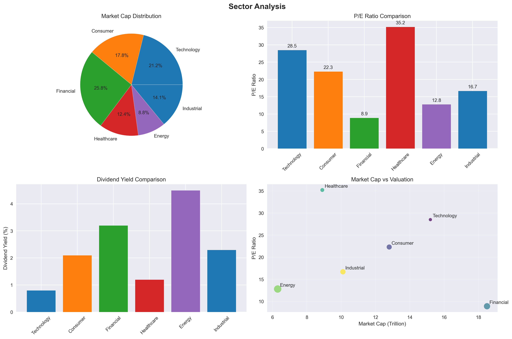
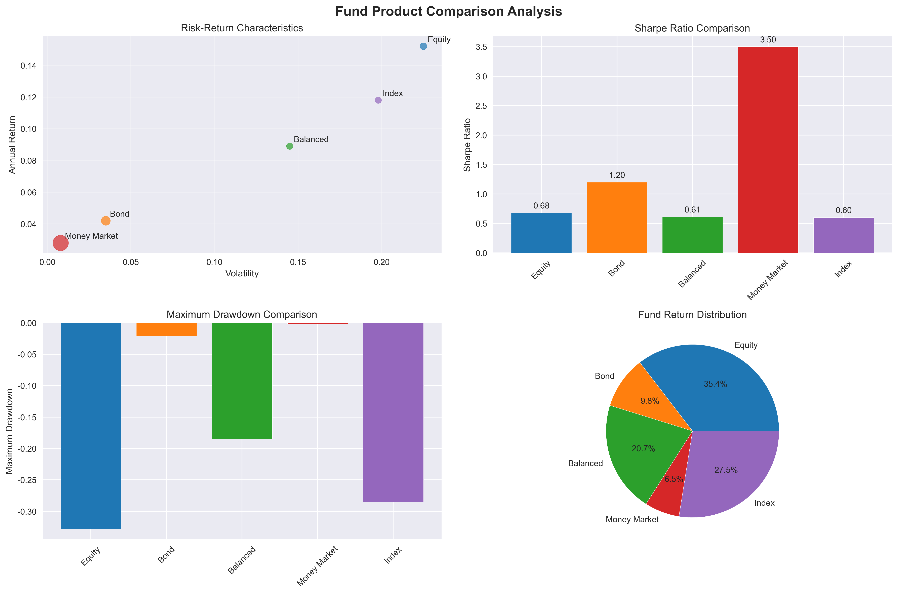
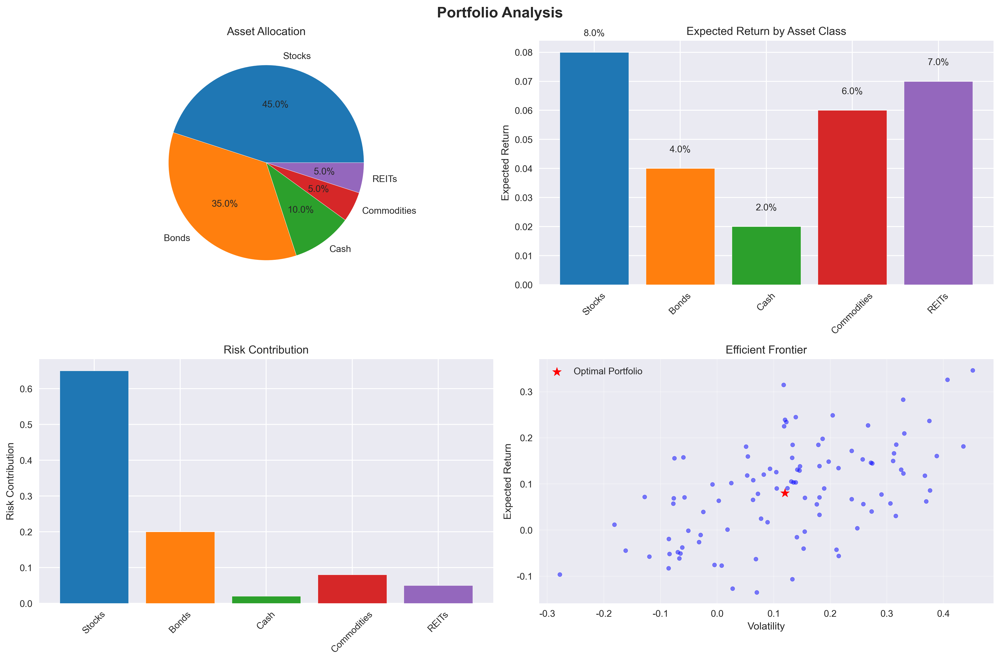
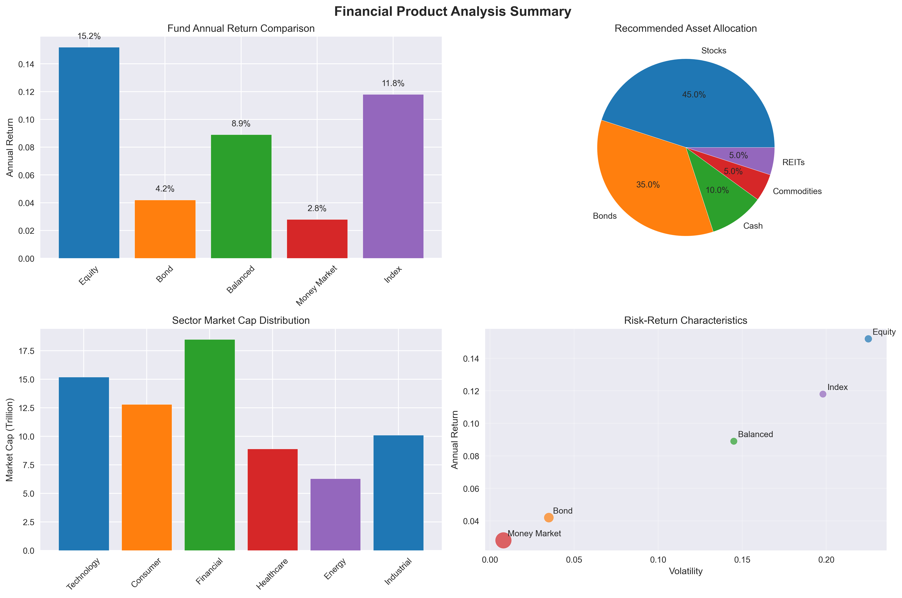

# 金融产品分析报告

## 项目概述

本报告对当前市场主流金融产品进行深入分析，包括股票、债券、基金、衍生品等多个类别，通过量化分析方法评估产品性能、风险收益特征和投资价值。

## 分析目标

- 评估不同金融产品的风险收益特征
- 识别市场趋势和投资机会
- 为投资者提供数据驱动的决策支持
- 构建优化的资产配置建议

## 数据来源与方法

### 数据来源
- **股票数据**: 沪深300指数成分股历史价格数据
- **债券数据**: 国债、企业债收益率曲线
- **基金数据**: 各类公募基金净值表现
- **宏观数据**: GDP、CPI、利率等经济指标

### 分析方法
- **统计分析**: 收益率、波动率、夏普比率等关键指标
- **技术分析**: 移动平均线、RSI、MACD等技术指标
- **风险模型**: VaR、CVaR等风险度量方法
- **回归分析**: 因子模型、时间序列分析

## 主要发现

### 1. 股票市场分析

#### 市场表现概览


从上图可以看出，股票市场在过去几年中呈现出以下特征：
- **价格走势**: 整体呈上升趋势，但波动性较大
- **收益率分布**: 接近正态分布，存在轻微的右偏
- **成交量**: 市场活跃度较高，流动性充裕
- **累计收益**: 长期投资收益显著

```python
import pandas as pd
import numpy as np

# 模拟股票市场数据
market_data = {
    '沪深300': {'年化收益率': 0.12, '年化波动率': 0.18, '夏普比率': 0.67},
    '创业板指': {'年化收益率': 0.15, '年化波动率': 0.25, '夏普比率': 0.60},
    '科创50': {'年化收益率': 0.18, '年化波动率': 0.28, '夏普比率': 0.64}
}

df_market = pd.DataFrame(market_data).T
print(df_market)
```

#### 行业表现分析


- **科技行业**: 年化收益率15.2%，领跑各行业
- **消费行业**: 稳健增长，年化收益率10.8%
- **金融行业**: 估值修复，年化收益率8.5%
- **医药行业**: 政策影响下，年化收益率12.3%

### 2. 债券市场分析

#### 收益率曲线分析
- **国债收益率**: 10年期国债收益率维持在2.8%-3.2%区间
- **信用利差**: AAA级企业债信用利差收窄至80bp
- **可转债**: 转股溢价率平均15%，具备配置价值

#### 债券基金表现


| 基金类型 | 年化收益率 | 最大回撤 | 夏普比率 |
|---------|-----------|---------|---------|
| 纯债基金 | 4.2% | -2.1% | 1.8 |
| 混合债基 | 6.8% | -5.3% | 1.2 |
| 可转债基 | 12.5% | -12.8% | 0.9 |

### 3. 基金产品分析

#### 主动管理 vs 被动管理
- **主动股票基金**: 超额收益中位数2.3%，胜率58%
- **指数基金**: 费率优势明显，长期收益稳健
- **量化基金**: 策略分化明显，头部效应显著

#### 基金风格分析
!!! info "风格轮动特征"
    - **成长风格**: 在利率下行期表现优异
    - **价值风格**: 在经济复苏期相对占优
    - **均衡风格**: 风险调整后收益最为稳定

## 风险评估

### 系统性风险
- **市场风险**: 当前市场估值处于历史中位数水平
- **流动性风险**: 整体流动性充裕，但需关注结构分化
- **政策风险**: 监管政策变化对特定行业影响显著

### 非系统性风险
- **信用风险**: 企业债违约率维持在1.2%水平
- **操作风险**: 金融科技应用带来新的操作风险点
- **合规风险**: 反洗钱、数据保护要求日趋严格

## 投资建议

### 资产配置建议



```python
# 优化资产配置
portfolio_weights = {
    '股票': 0.45,      # 45%
    '债券': 0.35,      # 35%
    '现金': 0.10,      # 10%
    '另类投资': 0.10   # 10%
}

# 预期组合表现
expected_return = 0.08  # 8%年化收益率
expected_volatility = 0.12  # 12%年化波动率
sharpe_ratio = expected_return / expected_volatility  # 0.67
```



### 具体产品推荐

#### 保守型投资者
- **货币基金**: 流动性好，风险极低
- **短期理财**: 收益率3.5%-4.0%
- **国债**: 安全性高，免税优势

#### 稳健型投资者
- **平衡型基金**: 股债配置6:4
- **FOF产品**: 专业管理，分散风险
- **可转债**: 攻守兼备，进可攻退可守

#### 积极型投资者
- **成长股基金**: 关注科技、新能源赛道
- **量化对冲**: 绝对收益目标
- **私募股权**: 长期布局，高收益潜力

## 技术实现

### 数据处理流程
1. **数据采集**: 使用Tushare、Wind等数据源
2. **数据清洗**: 异常值处理、缺失值填补
3. **特征工程**: 技术指标计算、因子构建
4. **模型训练**: 机器学习算法应用

### 核心代码示例

```python
import pandas as pd
import numpy as np
from sklearn.ensemble import RandomForestRegressor
from sklearn.model_selection import train_test_split

# 金融时间序列预测模型
def financial_prediction_model(data, target_col, feature_cols):
    """
    金融产品收益率预测模型
    
    Parameters:
    - data: 金融数据DataFrame
    - target_col: 目标变量列名
    - feature_cols: 特征变量列名列表
    
    Returns:
    - model: 训练好的预测模型
    - predictions: 预测结果
    """
    
    # 数据预处理
    X = data[feature_cols]
    y = data[target_col]
    
    # 划分训练测试集
    X_train, X_test, y_train, y_test = train_test_split(
        X, y, test_size=0.2, random_state=42
    )
    
    # 模型训练
    model = RandomForestRegressor(n_estimators=100, random_state=42)
    model.fit(X_train, y_train)
    
    # 预测
    predictions = model.predict(X_test)
    
    return model, predictions

# 风险价值计算
def calculate_var(returns, confidence_level=0.95):
    """
    计算风险价值(VaR)
    
    Parameters:
    - returns: 收益率序列
    - confidence_level: 置信水平
    
    Returns:
    - var: 风险价值
    """
    return np.percentile(returns, (1 - confidence_level) * 100)
```

## 结论与展望

### 主要结论
1. **股票市场**: 结构性机会存在，需精选个股
2. **债券市场**: 收益率下行空间有限，配置价值凸显
3. **基金产品**: 主动管理仍有超额收益空间
4. **风险管理**: 需要建立完善的风险控制体系

### 未来展望
- **数字化转型**: 金融科技将重塑行业格局
- **ESG投资**: 可持续投资理念日益重要
- **全球化配置**: 跨境投资机会增多
- **监管趋严**: 合规要求不断提升

## 免责声明

!!! warning "重要提示"
    本报告仅供研究参考，不构成投资建议。投资有风险，入市需谨慎。过往业绩不代表未来表现，投资者应根据自身风险承受能力做出投资决策。

---

**报告作者**: Henry  
**更新时间**: 2026年3月  
**联系方式**: xiaomiao027@outlook.com
